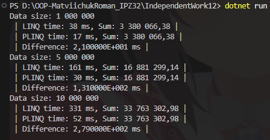
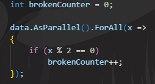
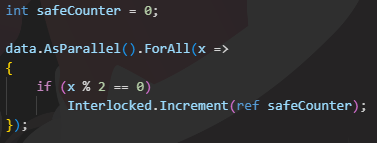

# Самостійна робота No12

**Тема:** *PLINQ: дослідження продуктивності та безпеки.*
---
**Мета:** *Дослідити переваги та недоліки PLINQ (Parallel LINQ) у порівнянні зі звичайним LINQ,
виміряти його продуктивність на різних обсягах даних та проаналізувати потенційні проблеми
безпеки при паралельній обробці.*

---

## Налаштування експерименту
- Дані: List<double> з випадковими числами від 0 до 1 000 000.
- Розміри колекцій:
  - 1 000 000
  - 5 000 000
  - 10 000 000
- Фільтрація: x > 500 000
- Функція HeavyMathOperation:
      sqrt → sin → cos → log
- Порівнював: LINQ vs PLINQ (AsParallel)
- Час вимірював через Stopwatch.

---
## Результати запуску:

Суми майже однакові — різниця тільки через double rounding. Це нормально.
---
## Side Effects — як паралельні задачі "ламають" змінні
Маю дані: від 1 до 2 000 000
Очікувано парних: 1 000 000
---
НЕПРАВИЛЬНО:

Результат: 

---
Причина:
- ++ у багатьох потоках = гонка даних. Частина інкрементів просто губиться.
---
ПРАВИЛЬНО:

---
Результат:

---
- Interlocked гарантує атомарність.
---
## Висновки:
1️. PLINQ дає сенс, коли:
   - великий обсяг даних (мільйони),
   - операції над елементом дорогі (математика, CPU),
   - порядок обробки неважливий.

2️. Якщо операція проста (x*2), виграш майже зникає —
   накладні витрати паралелиться не окупаються.

3️. Паралельність + глобальні змінні = небезпека.
   - ++, списки, словники без синхронізації — 💣
   - Використовуйте:
        Interlocked
        lock
        ConcurrentCollections
        або повністю уникайте side effects
---
PLINQ — не чарівна кнопка Turbo.
Він працює тоді, коли робота важка і велика.
Але якщо у паралельному коді змінювати спільні змінні без захисту —
проблеми гарантовані.
---
