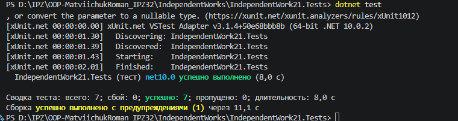

# Самостійна робота No21
## Тема: Інтеграційні тести патернів (підготовка до екзамену).

## 1. Опис системи
Для тестування було обрано комплексну систему управління подіями календаря, яка об'єднує 4 патерни проєктування:
- **Singleton**: `EventManager` (єдина точка керування).
- **Factory Method**: `LoggerFactory` (створює незалежних спостерігачів).
- **Strategy**: `CreateStrategy`, `UpdateStrategy` (зміна поведінки обробки подій).
- **Observer**: `MemoryLoggerObserver` (підписується на події `EventManager`).

## 2. Перелік сценаріїв та результати

### Позитивні сценарії:
1. **Створення події та сповіщення підписника (Full Integration)**
   - *Опис:* Отримання Singleton-менеджера, створення логера через фабрику, підписка на події, встановлення `CreateStrategy` та обробка даних.
   - *Очікуваний результат:* Логер містить 1 запис із текстом "Created: ...".
   - *Фактичний результат:* Успішно. Взаємодія всіх 4 патернів коректна.

2. **Зміна стратегії в рантаймі (Runtime Strategy Change)**
   - *Опис:* Система спочатку обробляє подію через `CreateStrategy`, потім "на льоту" стратегія змінюється на `UpdateStrategy` і обробляється інша подія.
   - *Очікуваний результат:* Спостерігач фіксує два різні результати відповідно до активної стратегії.
   - *Фактичний результат:* Успішно. Стратегія коректно змінюється без перестворення контексту.

3. **Розсилка декільком спостерігачам (Multiple Observers)**
   - *Опис:* Фабрика генерує 2 незалежні об'єкти-спостерігачі. Обидва підписуються на Singleton.
   - *Очікуваний результат:* Обидва логери отримують ідентичне сповіщення після обробки.
   - *Фактичний результат:* Успішно. Механізм мультикастингу делегатів (Observer) працює стабільно.

### Негативні сценарії:
4. **Обробка без встановленої стратегії (No Strategy Provided)**
   - *Опис:* Виклик методу `ProcessEvent` без попереднього виклику `SetStrategy`.
   - *Очікуваний результат:* Викидання винятку `InvalidOperationException`.
   - *Фактичний результат:* Успішно. Система захищена від відсутності стратегії.

5. **Передача невалідних даних (Empty/Null Data)**
   - *Опис:* Передача `null` або порожнього рядка в `ProcessEvent` за наявності валідної стратегії.
   - *Очікуваний результат:* Викидання винятку `ArgumentException`.
   - *Фактичний результат:* Успішно. Валідація працює до передачі даних у логіку стратегії.

## 3. Короткий висновок по ризиках
1. **Ризик Singleton'а:** Оскільки `EventManager` зберігає глобальний стан (список підписників та поточну стратегію), під час запуску тестів виник ризик перехресного забруднення даних між тестами. Це було вирішено додаванням методу `ResetInstance()`, який очищує стан перед кожним тестом у конструкторі xUnit.
2. **Ризик втрати подій (Observer):** Якщо підписник викличе виняток під час обробки події, подальша розсилка іншим спостерігачам у ланцюжку делегата обірветься. Для production-систем варто огортати виклик підписників у блок `try-catch` або використовувати черги повідомлень.
3. **Архітектурна стабільність:** Тести підтвердили, що дотримання принципів SOLID (зокрема Dependency Inversion) дозволяє легко ізолювати та перевірити роботу комбінації з 4-х патернів.

## 4. Результат

## Висновок
Під час виконання самостійної роботи було успішно проведено інтеграційне тестування складної системи, побудованої на базі чотирьох патернів проєктування (Singleton, Factory Method, Strategy, Observer). За допомогою фреймворку xUnit було написано та виконано 3 позитивні та 2 негативні сценарії. Тести на практиці підтвердили коректну взаємодію компонентів: стабільність глобального стану менеджера, правильну зміну алгоритмів поведінки в рантаймі, надійне створення об'єктів фабрикою та безперебійну розсилку сповіщень підписникам. Поставлена мета роботи досягнута повністю.