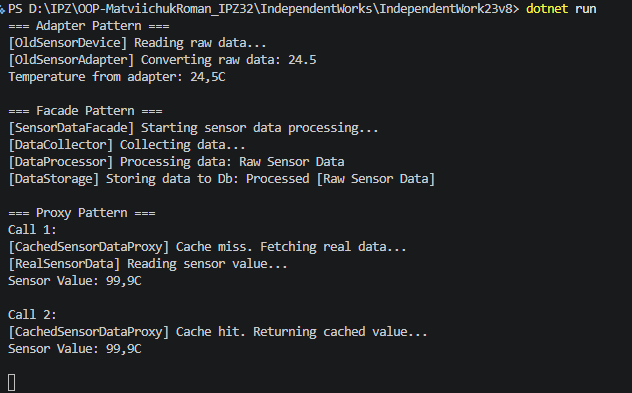

# Самостійна робота No23
## Тема: Adapter + Facade + Proxy: кеш і ліміти
## Варіант: 8 (Обробка даних з сенсорів)

## Мета роботи
Реалізувати інтеграційний сценарій з використанням патернів Adapter, Facade та Proxy для обробки даних сенсорів, налаштування кешування та спрощення взаємодії зі складними підсистемами.

## Опис реалізації
1. **Патерн Adapter:** Було реалізовано клас `OldSensorAdapter`, який обгортає старий клас `OldSensorDevice`. Адаптер конвертує дані з несумісного формату (`string`) у необхідний системі формат (`double`), імплементуючи цільовий інтерфейс `ISensorReader`.
2. **Патерн Facade:** Створено клас `SensorDataFacade`, який надає єдиний метод `ProcessSensorData()`. Він приховує за собою логіку взаємодії трьох різних підсистем: `DataCollector`, `DataProcessor` та `DataStorage`. Клієнтському коду не потрібно знати про послідовність їх виклику.
3. **Патерн Proxy:** Клас `CachedSensorDataProxy` реалізує контроль доступу до "важкого" класу `RealSensorData`. Під час першого запиту Proxy ініціалізує реальний об'єкт та зберігає результат у кеш. При наступних викликах дані повертаються миттєво з кешу, заощаджуючи ресурси та час.

## Результат:

## Контрольні питання

**1. Поясніть патерн Adapter. Коли його слід використовувати?**
Патерн Adapter дозволяє об'єктам із несумісними інтерфейсами працювати разом. Він діє як "перехідник". Його слід використовувати, коли є існуючий клас (наприклад, стара бібліотека або стороннє API), який виконує потрібну роботу, але його інтерфейс не відповідає вимогам вашої поточної системи, і ви не можете або не хочете змінювати вихідний код цього класу.

**2. Поясніть патерн Facade. Як він спрощує роботу зі складними підсистемами?**
Facade надає простий, уніфікований інтерфейс високого рівня до складної системи класів, фреймворків чи бібліотек. Замість того, щоб змушувати клієнта розбиратися з десятками методів різних підсистем та правильною послідовністю їх викликів, Facade надає кілька зручних методів, які роблять всю чорнову роботу всередині. Це зменшує зв'язність коду (coupling).

**3. Поясніть патерн Proxy. Наведіть приклади різних типів Proxy (Virtual, Protection, Logging).**
Proxy створює об'єкт-замінник, який контролює доступ до оригінального об'єкта. Він має такий самий інтерфейс, як і оригінал. 
* **Virtual Proxy (Віртуальний):** Відкладає створення "важкого" об'єкта до моменту, коли він дійсно знадобиться (ледаче завантаження), або кешує його результати.
* **Protection Proxy (Захисний):** Перевіряє, чи має клієнт права доступу для виконання запиту до реального об'єкта.
* **Logging Proxy (Логуючий):** Веде історію звернень до об'єкта, записуючи параметри та результати методів.

**4. У чому полягає ключова відмінність між Adapter, Facade та Proxy?**
* **Adapter** *змінює* інтерфейс існуючого об'єкта, щоб зробити його сумісним з іншим.
* **Facade** *спрощує* інтерфейс цілої підсистеми об'єктів, але не приховує їх повністю (до них все ще можна звернутися напряму).
* **Proxy** *зберігає* інтерфейс оригінального об'єкта один до одного, але *контролює* доступ до нього (додаючи кеш, захист чи логування).