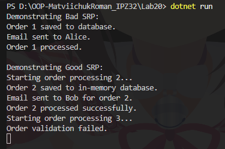

# Лабораторна робота No20
## Тема: SRP: декомпозиція `OrderProcessor.`
## Мета: Застосувати принцип єдиної відповідальності (SRP) для декомпозиції складного класу `OrderProcessor` на менші, більш сфокусовані компоненти.

---

## Завдання
1. Створено початковий клас `OrderProcessor`, який порушує SRP:
   - Виконує валідацію замовлення
   - Зберігає замовлення
   - Відправляє email сповіщення
   - Оновлює статус замовлення
2. Виконано рефакторинг для дотримання SRP:
   - Виділено інтерфейси:
     - `IOrderValidator`
     - `IOrderRepository`
     - `IEmailService`
   - Реалізовано відповідні класи:
     - `OrderValidator`
     - `InMemoryOrderRepository`
     - `ConsoleEmailService`
   - Створено `OrderService`, який координує роботу цих компонентів через Dependency Injection.
3. Демонстрація роботи:
   - Валідне замовлення обробляється і зберігається, відправляється email, статус змінюється на `Processed`.
   - Невалідне замовлення не проходить валідацію, статус змінюється на `Cancelled`.

---

## Демонастрація

- Валідне замовлення (`ID=2`) оброблено успішно  
- Невалідне замовлення (`ID=3`) не пройшло валідацію

---

## Висновок:
- Початковий клас `OrderProcessor` **порушує SRP** — він робить занадто багато дій.  
- Після рефакторингу:
  - Кожен клас виконує **одну відповідальність**.
  - `OrderService` координує роботу компонентів.
- Лабораторна показала правильне застосування **SRP** та **Dependency Injection** для покращення структури коду.
