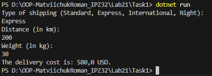
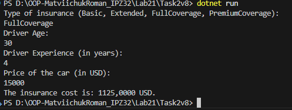

# Лабораторна робота No21
## Тема: OCP: гнучкі алгоритми розрахунку (Factory/Strategy).
## Мета: Застосувати принцип відкритості/закритості (OCP) для створення гнучкої системи розрахунків за допомогою патернів Factory Method та Strategy, забезпечивши можливість легкого додавання нових алгоритмів без зміни існуючого коду.
## Task 1
### Завдання 
Реалізував чотири стратегії страхування:
1. **StandardShippingStrategy** – стандартна доставка
2. **ExpressShippingStrategy** – експрес-доставка
3. **InternationalShippingStrategy** – міжнародна доставка
4. **NightShippingStrategy** – нічна доставка (демонстрація розширюваності)
## Використані патерни
- **Strategy** – для реалізації різних алгоритмів розрахунку вартості доставки.
- **Factory** – для створення об’єкта стратегії на основі вибору користувача.

## Демонстрація роботи:

- Валідний вибір типу доставки обробляється успішно.
- Невірний тип доставки виводить повідомлення: `Invalid shipping type`.

## Task 2
### Завдання 
Реалізовано чотири стратегії страхування:
1. **BasicInsuranceStrategy** – базова страховка
2. **ExtendedInsuranceStrategy** – розширена страховка
3. **FullCoverageStrategy** – повне покриття
4. **PremiumCoverageStrategy** – преміум-покриття (демонстрація OCP)
## Використані патерни
- **Strategy** – для реалізації різних алгоритмів розрахунку вартості доставки.
- **Factory** – для створення об’єкта стратегії на основі вибору користувача.

## Демонстрація роботи:

- Валідний вибір страховки обробляється правильно.
- Невірний тип страховки виводить повідомлення: `Invalid insurance type.`

## Висновок:
Під час виконання лабораторної роботи я зрозумів, що застосування патернів Strategy та Factory дозволяє створювати гнучкі та розширювані системи, де логіка розрахунку винесена в окремі класи стратегій, а основні сервіси і Main залишаються чистими та простими, і для додавання нових алгоритмів не потрібно змінювати існуючий код, що повністю відповідає принципу OCP і робить програму легко підтримуваною та масштабованою.
