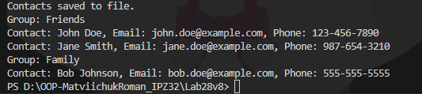

# Лабораторна робота №28
## Тема: Серіалізація об’єктів у JSON.
# Мета: Навчитися серіалізувати та десеріалізувати складні об’єкти у форматі JSON, зберігати дані у файли та завантажувати їх.
Реалізував 3 класи предметні області:
- Contact - зберігаються контакт працівника та містить такі поля: індефікаційний код, ім'я, ел. пошта та номер телефона.
- Group - зберігаються група і працівників.
- ContactRepositroy - репозиторій, який відповідає за серіалізацію об'єктів у JSON.

### Зв'язки між класами:
---
У даній роботі реалізовано наступні зв’язки між класами:

#### Між класами Group та Contact існує зв’язок типу “один до багатьох”, оскільки одна група може містити багато контактів. Це реалізовано через колекцію List<Contact> у класі Group.
#### Клас ContactRepository виконує роль репозиторію та працює з колекцією об’єктів Group, забезпечуючи доступ до даних, їх збереження та завантаження.
#### Клас Contact не має прямих зв’язків з репозиторієм, а входить до складу класу Group, що відповідає принципу композиції.
### Тип зв’язків

Композиція - між Group і Contact (контакти існують в межах групи)
Агрегація через ContactRepository
---
### Реалізований функціонал
У класі ContactRepositroy реалізовано наступні методи:
- Add() - додає нову групу контактів до списку.
- GetAll() - дає усі групи.
- GetById(int id) - повертає групу за id.
- SaveToFileAsync(string filename) - асинхронно зберігає дані у JSON.
- LoadFromFileAsync(string filename) - асинхронно завантажує дані з JSON-файлу.
---
### Результат:

[contact.json](contacts.json)

## Висновок:
У ході виконання лабораторної роботи було реалізовано такі класи: Contact, Group, ContactRepository та методи. Освоєно принципи серіалізації та десеріалізації об’єктів у форматі JSON з використанням бібліотеки System.Text.Json.