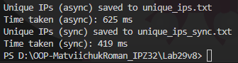

# Лабораторна робота No29. Варіант №8
## Тема: Асинхронне читання великих файлів.
## Мета: Навчитися ефективно працювати з великими файлами за допомогою асинхронного потокового читання та запису.

## Завдання:
Реалізував клас IpFileProcessor, який генерує 1 млн. ip адрес, асинхроно читає файл, підраховує унікальні ip, синхроно читає файл для порівняння продуктивності і записує унікальні ip у файл.
Виміряно час роботи асинхронного та синхроного методів. 
## Хід роботи:
- Згенеровано файл ips.txt з 1 000 000 рядків випадкових IP-адрес.
- Виконано асинхронне читання та підрахунок унікальних IP через StreamReader.ReadLineAsync().
- Запис результату у файл unique_ips.txt асинхронно.
- Виконано синхронне читання та підрахунок унікальних IP для порівняння продуктивності.
- Виміряно час роботи кожного способу за допомогою Stopwatch.
## Результати:

## Висновок
Під час виконання лабораторної роботи, було реалізовано клас IpFileProcessor, який генерує великий файл з 1000000 IP-адрес, асинхронно та синхронно обробляє його, підраховує унікальні IP-адреси та зберігає результат у файл.

Хоча в даному експерименті синхронний метод виявився швидшим, це пояснюється тим, що файл зберігається на локальному SSD-диску, де накладні витрати асинхронності (створення задач, очікування) можуть перевищувати вигоду. Асинхронність стає помітно ефективнішою при роботі з великими файлами, мережевими ресурсами або під час одночасної обробки декількох файлів.