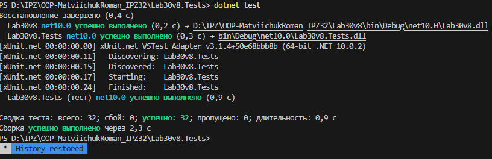

# Лабораторна робота No33. Варіант №8
## Тема: Написання юніт-тестів з xUnit.
## Мета: Навчитися писати юніт-тести для власного коду за допомогою xUnit, використовуючи різні типи assertion та параметризовані тести.

## Завдання:
Для тестування програми, реалізував програму `BankAccount` [Глянути](/Lab30v8/)

### 1) Конструктор
Перевірено:
- створення акаунта з коректним ім’ям і балансом;
- створення акаунта з нульовим балансом.

### 2) Метод `Deposit`
Перевірено:
- поповнення на додатну суму;
- параметризовані тести з різними сумами;
- викидання `ArgumentOutOfRangeException` для `0` і від’ємних значень.

### 3) Метод `Withdraw`
Перевірено:
- зняття коректної суми;
- зняття всієї суми до нуля;
- параметризовані тести;
- викидання `ArgumentOutOfRangeException` для `0` і від’ємних значень;
- викидання `InvalidOperationException` при спробі зняти більше за баланс;
- незмінність балансу після невдалої операції.

### 4) Метод `Transfer`
Перевірено:
- коректний переказ між рахунками;
- переказ усієї суми;
- параметризовані тести;
- `ArgumentNullException` для `null`-рахунку отримувача;
- `ArgumentOutOfRangeException` для `0` і від’ємних значень;
- `InvalidOperationException` для недостатнього балансу;
- незмінність балансів при невдалій операції.

### 5) Комплексні сценарії
Перевірено:
- послідовність `Deposit + Withdraw + Transfer`;
- ланцюжок переказів між кількома рахунками;
- роботу з великими сумами;
- роботу з десятковими значеннями.

## Типи тестів
- `[Fact]` — для одиночних сценаріїв.
- `[Theory]` + `[InlineData]` — для параметризованих перевірок.

[Глянути xUnit](/Lab30v8.Tests/UnitTest1.cs)
## Результат

## Висновок
Під час виконання лабораторної роботи отримано практичні навички:
- написання юніт-тестів у xUnit;
- перевірки очікуваних результатів через `Assert`;
- тестування винятків;
- створення параметризованих тестів;
- перевірки граничних і комплексних сценаріїв.