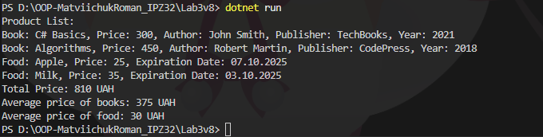

# Лабораторна робота №3. Варіант №8

**Тема:** *Наслідування: основи*

**Мета:** *закріпити знання про базові класи, похідні класи, модифікатори доступу, використання base, поліморфізм у простій формі.*
##
## Опис виконаної роботи
- Створив клас `Product` з властивостями `Name` та `Price`, а також методом `DisplayInfo()`. [глянути](https://github.com/romansxxq/OOP-MatviichukRoman_IPZ32/blob/main/Lab3v8/Product.cs)
- Реалізував класи `Book` та `Food`, які наслідують `Product` та перевизначають метод `DisplayInfo()`. [глянути Book](https://github.com/romansxxq/OOP-MatviichukRoman_IPZ32/blob/main/Lab3v8/Book.cs) [глянути Food](https://github.com/romansxxq/OOP-MatviichukRoman_IPZ32/blob/main/Lab3v8/Food.cs)
- У головній програмі створено список продуктів різних типів, виведено інформацію про кожен продукт, а також обчислено загальну та середню ціну. [глянути](https://github.com/romansxxq/OOP-MatviichukRoman_IPZ32/blob/main/Lab3v8/Program.cs)
## Результат роботи:

## Висновки
В ході виконання лабораторної роботи було закріплено навички роботи з наслідуванням, поліморфізмом та колекціями у C#. Отримано практичний досвід створення ієрархії класів та використання перевизначення методів.
## Контрольні запитання
1. Що таке наслідування та для чого воно використовується?
> Наслідування - це процес, коли клас успадковує властивості та методи іншого класу. Це дозволяє створювати більш складні
структури даних, які можуть наслідувати та доповнювати функціональність вже існуючих класів.
2. Чим відрізняється `virtual` від `abstract` методу?
> `virtual`-метод має реалізацію за замовчуванням і може бути перевизначений у похідних класах.
`abstract`-метод не має реалізації в базовому класі, його обов’язково потрібно реалізувати у похідних класах.

3. Як працює ключове слово `base`?
> `base` використовується для звернення до членів базового класу (методів, властивостей, конструкторів) із похідного класу.

4. Що таке поліморфізм часу виконання?
> Це здатність об’єктів похідних класів по-різному реалізовувати методи, оголошені у базовому класі, причому вибір реалізації відбувається під час виконання програми (через `override`/`virtual`/`abstract`).

5. У чому різниця між композицією та наслідуванням?
> Наслідування — це відношення "є" (is-a), коли клас успадковує властивості іншого класу.
Композиція — це відношення "має" (has-a), коли клас містить об’єкти інших класів як свої поля.
Композиція гнучкіша, дозволяє змінювати поведінку без зміни ієрархії.

