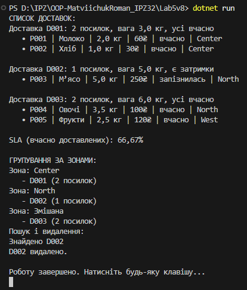

# Лабораторна робота №4. Варіант №8

**Тема:** *Узагальнені типи (Generics), колекції і LINQ, обробка винятків.*
---
**Мета:** * Навчитися створювати узагальнені класи/методи, працювати з колекціями та LINQ, коректно валідувати вхідні дані і створювати/обробляти винятки.*
---

## Опис виконаної роботи (Варіант №8)
- Створено клас Package, який містить інформацію про посилку: ідентифікатор, назву товару, вагу, вартість, зону доставки та стан (вчасно/запізнилась).

- Валідація даних: некоректна вага або ціна -> InvalidPackageException.

- Створено клас Delivery, який компонує список об’єктів Package.

- Має методи:

- TotalWeight() — загальна маса;

- TotalPrice() — сумарна вартість;

- IsOnTime() — чи всі пакунки доставлені вчасно;

- GetZone() — визначення зони доставки (одна або змішана).

- Узагальнений репозиторій Repository<T> реалізує операції зберігання, пошуку, видалення та виводу елементів.

- Реалізовано клас DeliveryStatistics:

- SLA() — підрахунок відсотка вчасних доставок;

- GroupByZone() — групування доставок за зонами.

- У Program.cs створено приклади доставок, продемонстровано обчислення, групування та обробку винятків.

---
## Опис виконанної роботи (Бонус №16) [Перейти до Bonus(Lab5v16)](D:\IPZ\OOP-MatviichukRoman_IPZ32\Bonus(Lab5v16))

- Створено клас Rate, який описує валютну пару (From, To, Value).

- Створено клас RateTable, що містить список курсів (композиція) і дозволяє отримувати курс між валютами.

- Реалізовано узагальнений клас Maybe<T> — контейнер для значення, яке може бути відсутнім.

- Створено власний виняток MissingRateException, який генерується, якщо відсутній потрібний курс.

- Клас Converter виконує:

- Просту конвертацію (Convert);

- Конвертацію за ланцюгом (ConvertChain), наприклад UAH→USD→EUR;

- Обчислення ефективного курсу (EffectiveRate).

- Результати округлюються до 2 або 4 знаків.
---
## Результат роботи (Варіант №8):

---
## Результат роботи (Варіант №16):

---
## Висновки:
В ході виконання лабораторної роботи:

1. Освоєно створення класів із композицією (Delivery → Package, Converter → RateTable).

2. Використано узагальнені типи для універсального репозиторію (Repository<T>) та контейнера (Maybe<T>).

3. Використано LINQ-запити для групування, фільтрації та обчислення статистики.

4. Реалізовано власні винятки для контролю логіки (некоректні дані, відсутні курси).

5. Закріплено вміння структурувати програму, відокремлювати логіку, обробляти помилки і презентувати результати.
---
## Контрольні запитання

1. Що таке композиція і навіщо вона потрібна?

>Композиція — це відношення “has-a” (має). Один клас містить об’єкти іншого і керує їх життєвим циклом. Використовується для розділення відповідальності між об’єктами.

2. Що таке узагальнення (Generics) і яку користь воно дає?

>Generics дозволяють створювати універсальні класи та методи, що працюють з будь-яким типом без дублювання коду. Наприклад, Repository<T> або Maybe<T>.

3. Як LINQ допомагає в роботі з колекціями?

>LINQ дозволяє виконувати запити (Select, Where, GroupBy, Aggregate) у декларативному стилі, роблячи код коротшим та зрозумілішим.

4. У чому різниця між композицією та агрегацією?

>Композиція — сильний зв’язок: об’єкт містить інший і відповідає за його створення та знищення.

>Агрегація — слабший зв’язок: об’єкт лише посилається на інший, але не контролює його життєвий цикл.

5. Навіщо створювати власні винятки?

>Щоб чітко розрізняти типи помилок у бізнес-логіці. Наприклад, MissingRateException одразу показує, що відсутній курс конвертації.
