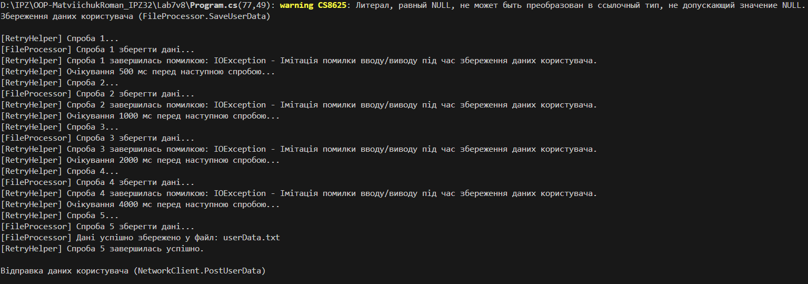
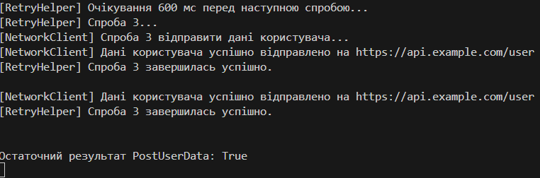

# Лабораторна робота №7. Варіант №8

**Тема:** *Обробка IO/мережевих помилок та патерн Retry.*

---

**Мета:** *Навчитися обробляти типові помилки вводу/виводу та мережеві помилки за допомогою блоків `try-catch-finally`, а також реалізувати узагальнений патерн Retry з експоненційною затримкою для підвищення відмовостійкості застосунків.* :contentReference[oaicite:0]{index=0}

---

## Опис виконаної роботи (Варіант №8)

Усі класи (`FileProcessor`, `NetworkClient`, `RetryHelper`) та метод `Main` були реалізовані в одному файлі `Program.cs` у просторі імен `Lab7v8`.

У ході виконання роботи було реалізовано:

- Створено клас **`FileProcessor`**, який імітує збереження даних користувача у файл методом  
  `void SaveUserData(string path, string userData)`.  
  За умовою варіанту №8 перші **4 виклики** методу призводять до викидання `IOException`, а починаючи з 5-ї спроби – операція вважається успішною (вивід відповідного повідомлення в консоль).

- Створено клас **`NetworkClient`**, який імітує відправку даних користувача на сервер методом  
  `bool PostUserData(string url, string userData)`.  
  Перші **2 виклики** методу викидають `HttpRequestException`, а починаючи з 3-ї спроби – імітується успішна відправка даних (повертається `true` і виводиться повідомлення в консоль).

- Реалізовано узагальнений статичний клас **`RetryHelper`** з методом  
  `public static T ExecuteWithRetry<T>(Func<T> operation, int retryCount = 3, TimeSpan initialDelay = default, Func<Exception, bool> shouldRetry = null)`, який:
  - приймає операцію у вигляді делегата `Func<T>`;
  - виконує операцію з повторними спробами у випадку помилок;
  - використовує експоненційну затримку між спробами: `delay = baseDelay * 2^(attempt - 1)`;
  - логують номер спроби, тип і текст винятку;
  - за допомогою делегата `shouldRetry` вирішує, чи потрібно повторювати спробу для конкретного типу винятку (`IOException` або `HttpRequestException`).

- У методі **`Main`**:
  - створено об’єкти `FileProcessor` та `NetworkClient` з відповідними параметрами кількості збоїв;
  - задано тестові дані: шлях до файлу, URL-адресу та JSON-рядок із даними користувача;
  - продемонстровано роботу `RetryHelper.ExecuteWithRetry` для:
    - `fileProcessor.SaveUserData(path, userData)` з `retryCount: 4` та початковою затримкою `500 мс`;
    - `networkClient.PostUserData(url, userData)` з `retryCount: 2` та початковою затримкою `300 мс`;
  - використано `try-catch` у `Main` для обробки ситуацій, коли кількість спроб вичерпано й виняток повторно пробрасывається нагору.

---

## Результат роботи (Варіант №8):

Під час запуску програми в консолі спостерігається послідовність спроб із логуванням:

- Для збереження даних користувача у файл:
  - 1–4 спроби завершуються з помилкою `IOException` та повідомленням про очікування перед наступною спробою (затримка зростає експоненційно).
  - 5-та спроба: виводиться повідомлення  
    `[FileProcessor] Дані успішно збережено у файл: userData.txt`  
    та лог від `RetryHelper` про успішне виконання операції.

- Для відправки даних користувача на сервер:
  - 1–2 спроби завершуються з `HttpRequestException`.
  - 3-тя спроба: виводиться повідомлення  
    `[NetworkClient] Дані користувача успішно відправлено на https://api.example.com/user`  
    а також підсумок:  
    `Остаточний результат PostUserData: True`.

Для звіту в Markdown можна вставити скріншот консолі:

---

## Висновки:

У процесі виконання лабораторної роботи №7 (варіант №8) було:

- розглянуто типові винятки вводу/виводу (`IOException`) та мережеві винятки (`HttpRequestException`), які часто виникають при роботі з файлами та HTTP-запитами;
- реалізовано просту, але наочну мітацію тимчасових помилок, коли перші кілька спроб завершуються збоєм, а наступна — успіхом;
- створено універсальний узагальнений метод `ExecuteWithRetry<T>`, що дозволяє повторювати будь-яку операцію, передану як `Func<T>`, із можливістю:
  - обмежити кількість повторних спроб (`retryCount`);
  - налаштувати початкову затримку (`initialDelay`);
  - гнучко керувати тим, для яких винятків слід виконувати повтор (`shouldRetry`);
- продемонстровано експоненційну затримку між спробами, що є типовим підходом у реальних системах для зменшення навантаження при масових збоях;
- показано, що правильне поєднання `try-catch`, логування та патерну Retry підвищує відмовостійкість та надійність застосунків.

Отже, поставлена мета роботи досягнута:  
було закріплено навички обробки винятків, реалізовано патерн Retry та продемонстровано його застосування на прикладі файлових і мережевих операцій.
