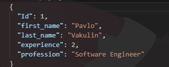
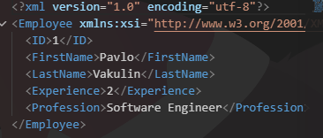

# Домашнє завдання (Лекція №22)
## Доповідь на тему: JSON vs XML: практичне порівняння.

У сучасній розробці ПЗ важливу роль відіграють формати обміну даними. Найпоширенішими серед яких є JSON (JavaScript Object Notation) та XML (eXtensible Markup Language). Обидва формати використовуються для зберігання і передачі структурованих даних, але вони мають відмінності у використанні, продуктивності та сфері застосування.

Припустимо, у нас буде клас Employee:
```csharp
public class Employee
{
    public int Id {get;set;}
    public string? first_name {get;set;}
    public string? last_name {get;set;}
    public int experience {get;set;}
    public string? profession {get;set;}
}
```
# Результат:
## JSON:

## XML: 

# Порівняння результатів:
Як бачимо, JSON більш компактний і читабельний. Він не використовує закриваючі теги, що зменшує розмір файлу та прискорює передачу даних. XML, навпаки, має більш громіздку структуру через використання тегів, подібний до HTML, але забезпечує краще формалізацію даних.
## Основні відмінності:
- JSON легший і швидший у обробці
- XML більш строгий і розширюваний
- JSON краще підходить для вебу
- XML — для складних систем, для прикладу - банківські системи.
# Реальні сценарії використання:
## JSON:
- API (обмін даними між фронтенд і бекенд)
- Мобільні додатки
- SPA-додатки (React, Angular)
## XML:
- Банківські системи
- SOAP API
- Конфігураційні файли у великих системах
# Чому JSON домінує у вебдодатках?
JSON став основним форматом у веброзробці через простий синтаксис, швидкість обробки, природну інтеграцію з JS та мешний обсяг переданих даних. 
Це особливо важливо для сучасних вебдодатків, де важлива швидкість і ефективність.
# Чому XML досі використовується?
Незважаючи на популярність JSON, XML залишається важливим у enterprise-середовищі через підтримку схем (XSD), можливість валідації структури, використання в legacy-системах, підтримку складних документів.

# Висновок
SON і XML мають різні сфери застосування. JSON є оптимальним вибором для сучасних веб-додатків завдяки простоті та швидкості, тоді як XML залишається важливим у складних корпоративних системах, де потрібна строгість і розширюваність. Вибір формату залежить від конкретних задач і вимог проєкту.