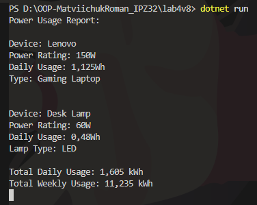

# Лабораторна робота №4. Варіант №8

**Тема:** *Абстракції та інтерфейси. Композиція та агрегація.*
---
**Мета:** *навчитися створювати абстрактні класи та інтерфейси, будувати ієрархії класів із використанням композиції та агрегації, реалізовувати прості обчислення споживання електроенергії, демонструвати гнучкість і повторне використання коду.*
---

## Опис виконаної роботи
- Створено інтерфейс `IPowerUsage` з методами `CalculatePowerUsagePerDay()`, `CalculatePowerUsagePerWeek()` та `ShowInfo()`.
- Реалізовано абстрактний клас `Device`, який містить загальні властивості для пристроїв (`Name`, `PowerRating`, `HoursUsedPerDay`) та частково реалізує інтерфейс.
- Реалізовано два класи-нащадки:
  - `Laptop` — враховує, чи ноутбук ігровий (`IsGaming`) та відповідно змінює розрахунок споживання.
  - `Lamp` — враховує тип лампи (`LampType`) та обчислює споживання.
- Створено клас `PowerCalculator`, який містить список пристроїв і дозволяє підраховувати сумарне споживання електроенергії (**композиція**).
- У головній програмі створено об’єкти `Laptop` та `Lamp`, додано їх до калькулятора, виведено детальний звіт.

---

## Результат роботи:

---
## Висновки:
В ході виконання лабораторної роботи було закріплено навички:
1. Створення абстрактних класів та інтерфейсів

2. Використання наслідування та перевизначення методів

3. Композиції для організації взаємодії класів

4. Розрахунку сумарного споживання електроенергії

5. Виводу інформації в зручному форматі
---
## Контрольні запитання

1. У чому різниця між абстрактним класом і інтерфейсом?

>Абстрактний клас може містити реалізацію методів, поля, конструктори і рівні доступу (protected, public). Використовується, коли є спільна логіка для декількох класів.

>Інтерфейс містить лише сигнатури методів, властивостей або подій. Використовується для визначення контракту, який можуть реалізувати будь-які класи.

2. Коли краще використовувати композицію, а коли наслідування?

>Наслідування — коли клас є спеціалізованим типом іншого (is-a).

>Композиція — коли клас складається з інших (has-a) і потрібно використовувати їх функціонал без жорсткого зв’язку.

3. Як працює агрегація та чим вона відрізняється від композиції?

>Агрегація — слабкий зв’язок: об’єкт одного класу посилається на об’єкт іншого, але не відповідає за його життєвий цикл.

>Композиція — сильний зв’язок: об’єкт одного класу містить інший об’єкт і відповідає за його створення та знищення.

4. Чи може клас реалізовувати кілька інтерфейсів одночасно?

>Так, клас у C# може реалізовувати будь-яку кількість інтерфейсів одночасно, що дозволяє комбінувати різні контракти без множинного наслідування.

5. Для чого в ООП використовують інтерфейси як контракти?

>Інтерфейси визначають обов’язковий набір методів та властивостей, які клас повинен реалізувати.
Це забезпечує гнучкість, поліморфізм і повторне використання коду, бо будь-який клас, що реалізує інтерфейс, може взаємодіяти з іншими компонентами через цей контракт.
